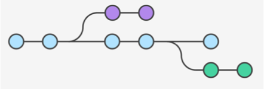

<!SLIDE bullet small transition=turnDown>

# Feature Branch Workflow

* All “feature” development takes place in a dedicated branch instead of **master**
  - Use descriptive names
* Keeps master clean
* Facilitates pull/merge requests and discussion

