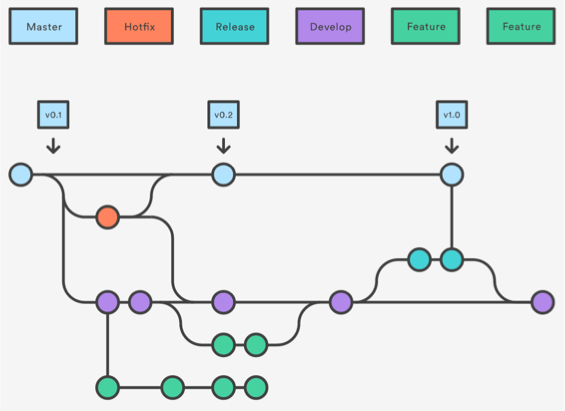
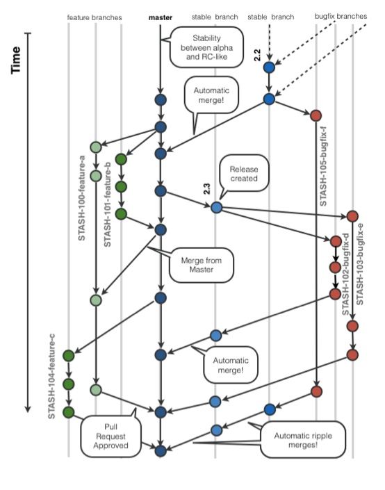

<!SLIDE bullet small transition=turnDown>

# Gitflow Workflow

* Similar to feature branch workflow
* Strict branching model with roles for each branch
  - **master** stores official release
  - **develop** stores feature integrations
  - **feature** branches use **develop** as parent
  - **release** branch (feature ready for deployment) is forked from **develop** and merged into **master** (and **develop** was released)
  - **maintenance / hotfix** branches are for quick production fixes, forked off **master** and merged into **master** and **develop** (or current **release**)

<!SLIDE center transition=turnDown>

<!SLIDE center transition=turnDown>

~~~SECTION:notes~~~

Branch / fork off develop.
Merge into master.

With exception of maintenance / hotfix.

~~~ENDSECTION~~~
