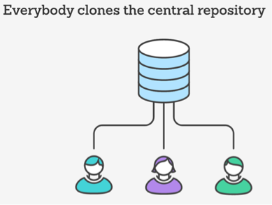

<!SLIDE bullet small transition=turnDown>

# Centralized Workflow

* Similar to SVN but with Git advantages
* Local repository for all (development isolation)
* Simple with single **master** for remote central repository

~~~SECTION:handouts~~~

You can create local branches and locally follow a different workflow.

~~~ENDSECTION~~~