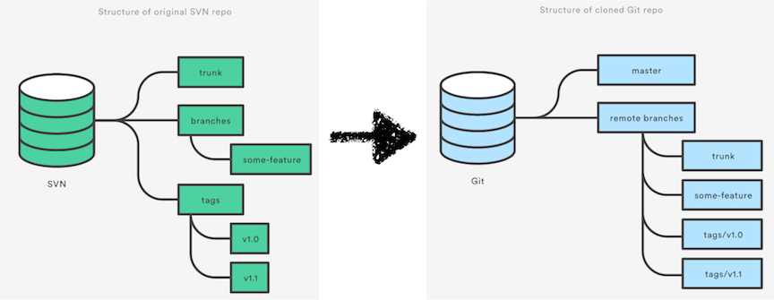

<!SLIDE bullet incremental small transition=fade>

# Migration to Git #

* Prepare environment
  - Git user accounts
  - Git repos 
* Convert SVN repo to Git repo
  - git-svn migration tool
* Synchronize the repositories
* Share Git repo
* Migrate efforts from SVN to Git
  - SVN freeze

<!SLIDE center transition=turnUp>

