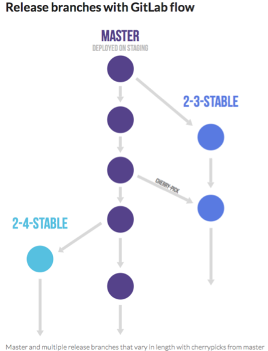
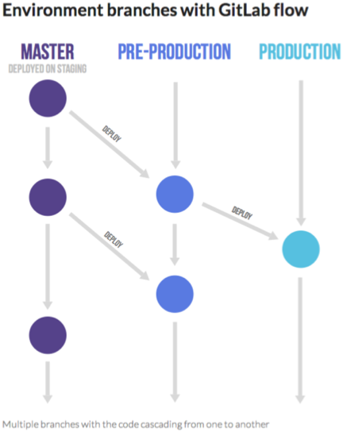

<!SLIDE transition=turnDown>

<!SLIDE transition=turnDown>

~~~SECTION:handouts~~~

The environment branch workflow can also be used for environments which can leverage a standard configuration (or set of template files) but can still have isolated differences. As an example, development, test and production servers for an Apache Web Server can use the same set of files with the same file locations but may have different content. This can be beneficial in configuration management systems such as Puppet.

~~~ENDSECTION~~~
